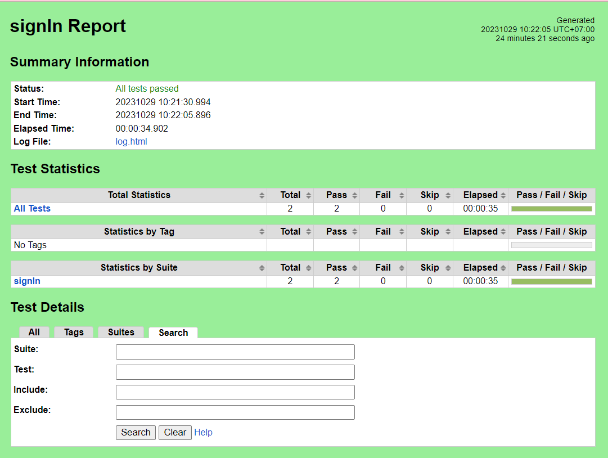

# Mobile Automation Script


## Introduction
This automation is written in Python programming language with RobotFramework
<br/> Technologies used:
<br/> [Python](https://www.python.org/downloads/windows/)
<br/> [Java](https://www.oracle.com/id/java/technologies/downloads/#jdk21-windows) 
<br/> [Android Studio](https://developer.android.com/studio)
<br/> [Appium Desktop](https://github.com/appium/appium-desktop/releases)
<br/> [Appium Inspector](https://github.com/appium/appium-inspector/releases)
<br/> [Scrcpy](https://github.com/Genymobile/scrcpy/blob/master/doc/windows.md)
<br/> [Pip Install](https://www.geeksforgeeks.org/how-to-install-pip-on-windows/)
<br/> [RobotFramework Guideline](https://robotframework.org/robotframework/latest/RobotFrameworkUserGuide.html#configuring-path)
<br/> [Appium Library Keywords](https://serhatbolsu.github.io/robotframework-appiumlibrary/AppiumLibrary.html#Open%20Application)

## Setup
### Pre-requisites
- Download and install dependencies mention above
- Download and install any Text Editor like Visual Code

### Run Project
- Clone the repository into a folder https://github.com/ervinyudistira/Sanber50-Mobile-Automation-Kelompok-4.git
- Go to Project root directory 
- Adjust device name based on your device
- Run suite ```$ python -m robot ./suites/{filename}```
- Execution Example [Click Here](https://drive.google.com/drive/folders/1BlN2Lcm4FUdHakORvAKlLLNfU8uEodyA)


# Reporter
The project uses reporter generated by Robot Framework. See the example of the report below:
